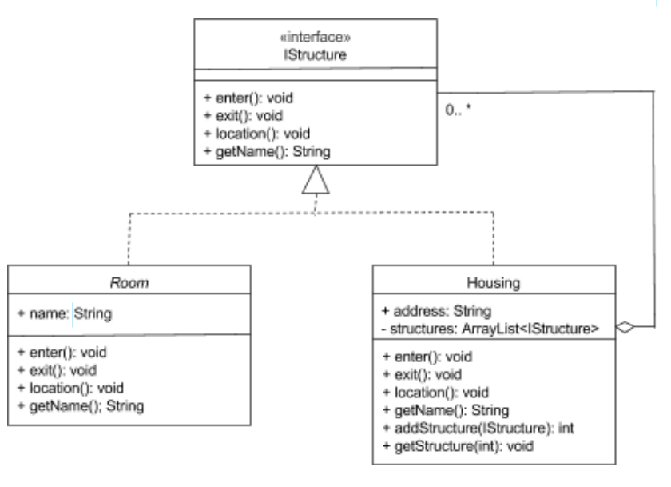

<h1>Composite Design Pattern</h1>
<h2>UML Diagram</h2>

<h2>Description  and Steps</h2>

<pre>

<h5>I have implemented the Composite Design Pattern which follows the following steps :  </h5>

 1. Design the interface(IStructure) that defines the overall type
 2. Implement the composite class(Housing)
 3. Implement the leaf class(Room)

</pre>
