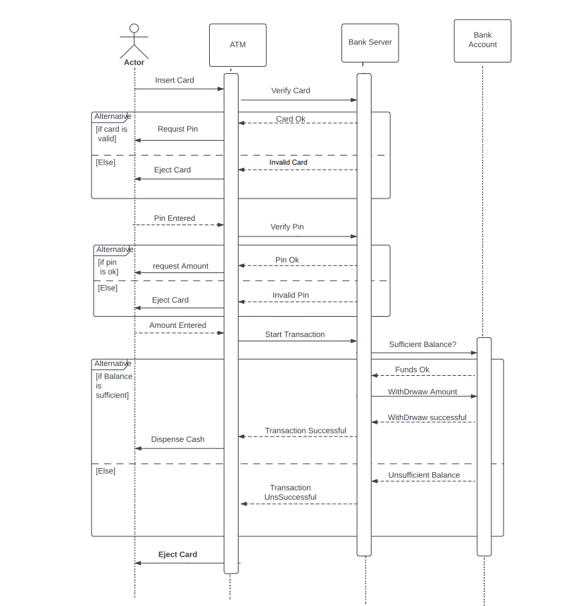

<h1>A UML Sequence Diagram for ATM Machine</h1>
<h3>Introduction</h3>
This report describes a simple technical report for a proposed ATM machine. The report includes a UML sequence diagram and an operating process for the ATM machine.

<h3>UML Sequence Diagram</h3>
The following UML sequence diagram shows the operating process of the proposed ATM machine:

<h3>Operating Process</h3>
The operating process of the proposed ATM machine is as follows:
The customer inserts their ATM card into the machine.
The ATM verifies the card and prompts the customer to enter their PIN.
The customer enters their PIN and the ATM verifies it.
The ATM displays a list of transaction options.
The customer selects the transaction they want to perform and enters the amount they want to withdraw (if applicable).
The ATM confirms the transaction and dispenses the cash (if applicable).
The ATM returns the card to the customer.

<h3>Conclusion</h3>
The proposed ATM machine is a simple and efficient way for customers to withdraw cash.The UML sequence diagram and operating process described in this report provide a clear and concise overview of how the ATM machine works.
